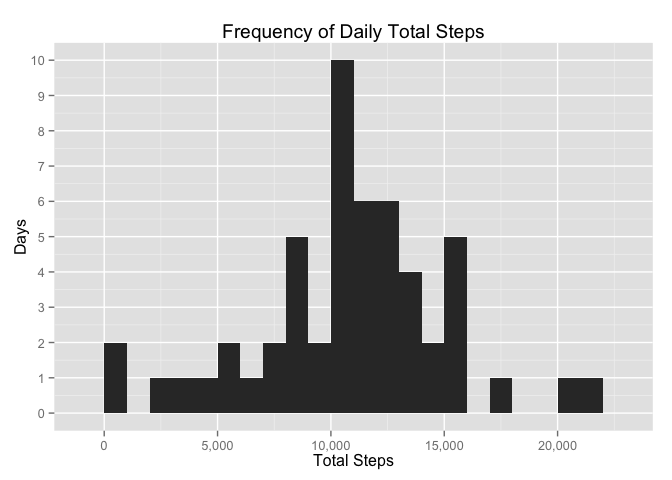
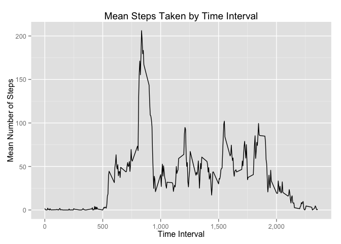
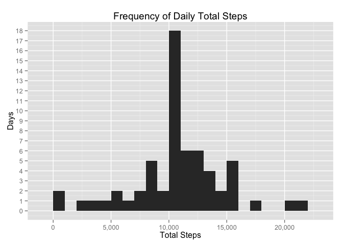
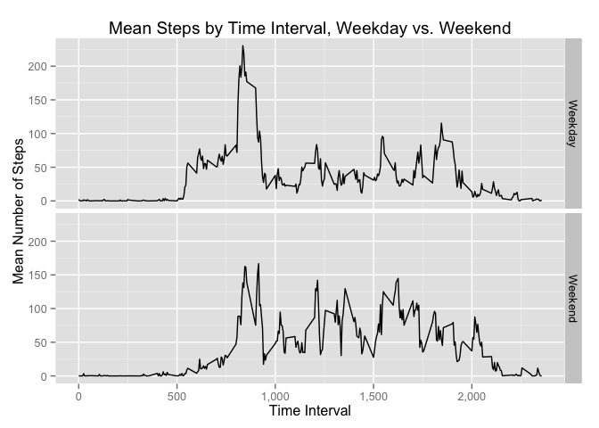

# Reproducible Research: Peer Assessment 1

## Load used libraries

```r
library(dplyr)
library(ggplot2)
library(scales)
```

## Loading and preprocessing the data

```r
df <- read.csv('activity.csv', as.is=TRUE)
df$date <- as.Date(df$date)
head(df)
```

```
##   steps       date interval
## 1    NA 2012-10-01        0
## 2    NA 2012-10-01        5
## 3    NA 2012-10-01       10
## 4    NA 2012-10-01       15
## 5    NA 2012-10-01       20
## 6    NA 2012-10-01       25
```

```r
str(df)
```

```
## 'data.frame':	17568 obs. of  3 variables:
##  $ steps   : int  NA NA NA NA NA NA NA NA NA NA ...
##  $ date    : Date, format: "2012-10-01" "2012-10-01" ...
##  $ interval: int  0 5 10 15 20 25 30 35 40 45 ...
```

## What is mean total number of steps taken per day?

```r
group_by(df, date) %>%
    summarize(total_steps = sum(steps)) %>%
    ggplot(aes(x=total_steps)) + 
    geom_bar(binwidth=1000) +
    scale_x_continuous(labels=comma, name='Total Steps') +
    scale_y_continuous(name='Days', breaks=c(0:10)) + 
    ggtitle('Frequency of Daily Total Steps')
```

 

```r
# find the mean and median
group_by(df, date) %>%
    summarize(total_steps = sum(steps)) %>%
    summarize(mean_total_steps_per_day = mean(total_steps, na.rm=TRUE),
              median_total_steps_per_day = median(total_steps, na.rm=TRUE)) %>%
    knitr::kable()
```

```
## 
## 
## | mean_total_steps_per_day| median_total_steps_per_day|
## |------------------------:|--------------------------:|
## |                    10766|                      10765|
```


## What is the average daily activity pattern?

```r
group_by(df, interval) %>%
    summarize(avg_steps = mean(steps, na.rm=TRUE)) %>%
    ggplot(aes(x=interval, y=avg_steps)) +
    geom_line() + 
    ggtitle('Mean Steps Taken by Time Interval') +
    scale_y_continuous(name='Mean Number of Steps') +
    scale_x_continuous(name='Time Interval', labels=comma)
```

 

```r
# Which 5-minute interval has the most steps on average?
group_by(df, interval) %>%
    summarize(avg_steps = mean(steps, na.rm=TRUE)) %>%
    filter(avg_steps == max(avg_steps)) %>%
    knitr::kable()
```

```
## 
## 
## | interval| avg_steps|
## |--------:|---------:|
## |      835|     206.2|
```


## Imputing missing values

```r
# how many NAs are there?
# it seems only the 'steps' variable has NAs:
summary(df)
```

```
##      steps            date               interval   
##  Min.   :  0.0   Min.   :2012-10-01   Min.   :   0  
##  1st Qu.:  0.0   1st Qu.:2012-10-16   1st Qu.: 589  
##  Median :  0.0   Median :2012-10-31   Median :1178  
##  Mean   : 37.4   Mean   :2012-10-31   Mean   :1178  
##  3rd Qu.: 12.0   3rd Qu.:2012-11-15   3rd Qu.:1766  
##  Max.   :806.0   Max.   :2012-11-30   Max.   :2355  
##  NA's   :2304
```

```r
# so count of rows with NA is basically the number of NAs in the 'steps' column:
sum(is.na(df$steps))
```

```
## [1] 2304
```

```r
# fill in NAs using the mean step count of the interval in question
df_imputed <- group_by(df, interval) %>%
    mutate(steps = ifelse(is.na(steps), mean(steps, na.rm=TRUE), steps)) %>%
    as.data.frame

# NAs are now gone:
summary(df_imputed)
```

```
##      steps            date               interval   
##  Min.   :  0.0   Min.   :2012-10-01   Min.   :   0  
##  1st Qu.:  0.0   1st Qu.:2012-10-16   1st Qu.: 589  
##  Median :  0.0   Median :2012-10-31   Median :1178  
##  Mean   : 37.4   Mean   :2012-10-31   Mean   :1178  
##  3rd Qu.: 27.0   3rd Qu.:2012-11-15   3rd Qu.:1766  
##  Max.   :806.0   Max.   :2012-11-30   Max.   :2355
```

```r
# histogram of the data with imputed values
# now more days right at the mean/median bucket
group_by(df_imputed, date) %>%
    summarize(total_steps = sum(steps)) %>%
    ggplot(aes(x=total_steps)) + 
    geom_bar(binwidth=1000) +
    scale_x_continuous(labels=comma, name='Total Steps') +
    scale_y_continuous(name='Days', breaks=c(0:20)) + 
    ggtitle('Frequency of Daily Total Steps')
```

 

```r
# have the mean and the median changed?
# almost not at all (the median increased by 1)
group_by(df_imputed, date) %>%
    summarize(total_steps = sum(steps)) %>%
    summarize(mean_total_steps_per_day = mean(total_steps, na.rm=TRUE),
              median_total_steps_per_day = median(total_steps, na.rm=TRUE)) %>%
    knitr::kable()
```

```
## 
## 
## | mean_total_steps_per_day| median_total_steps_per_day|
## |------------------------:|--------------------------:|
## |                    10766|                      10766|
```


## Are there differences in activity patterns between weekdays and weekends?

```r
# create factor variable for weekend vs. weekday 
df_imputed <- mutate(df_imputed,
       weekend = factor(ifelse(weekdays(date) %in% c('Sunday', 'Saturday'),
                               'Weekend', 'Weekday')))

# use facet grid to display the mean step trends by interval by weekend/weekday,
# it seems weekends have higher levels of activity across the entire day while
# weekdays have a spike in the morning followed by fewer steps until the evening.
# Also the subject wakes up later on the weekend and goes to bed later!:
group_by(df_imputed, weekend, interval) %>%
    summarize(avg_steps = mean(steps)) %>%
    ggplot(aes(x=interval, y=avg_steps)) +
    geom_line() +
    scale_y_continuous(name='Mean Number of Steps') +
    scale_x_continuous(name='Time Interval', labels=comma) +
    ggtitle('Mean Steps by Time Interval, Weekday vs. Weekend') + 
    facet_grid(weekend~.)
```

 
